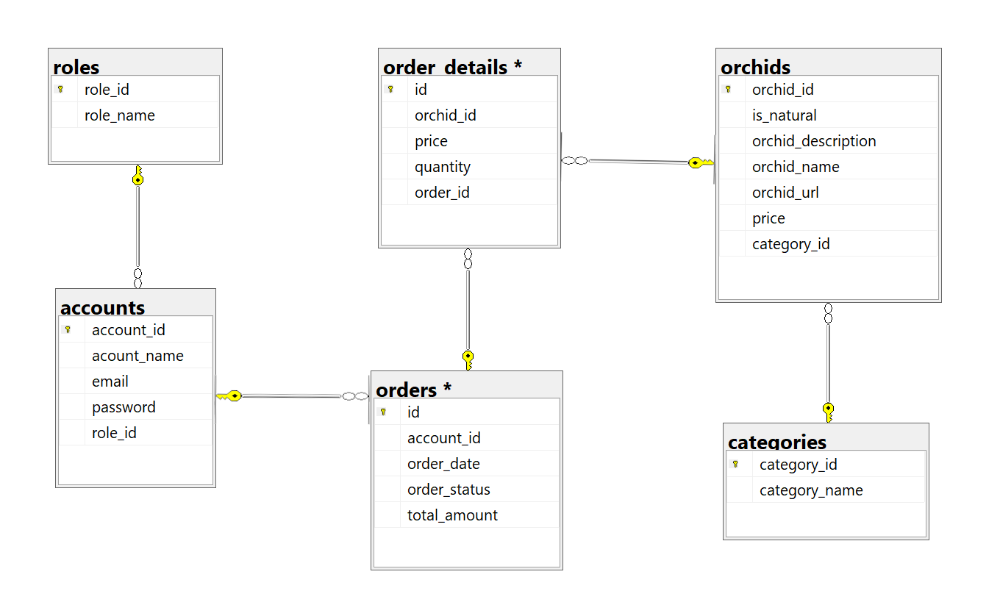

# OrchidsShop 🌺

A comprehensive orchid e-commerce platform built with .NET 8, featuring a clean N-layer architecture with Repository pattern and application services.

## 📋 Table of Contents

- [Overview](#overview)
- [Architecture](#architecture)
- [Technology Stack](#technology-stack)
- [Database Schema](#database-schema)
- [Project Structure](#project-structure)
- [Getting Started](#getting-started)
- [API Documentation](#api-documentation)
- [Development](#development)
- [Contributing](#contributing)

## 🌟 Overview

OrchidsShop is a modern e-commerce platform specifically designed for orchid enthusiasts and sellers. The platform provides a complete shopping experience with user authentication, product catalog management, and order processing capabilities.

### Key Features

- **Product Management**: Browse and manage orchid collections with detailed descriptions and pricing
- **User Authentication**: Secure account management with role-based access control
- **Order Management**: Complete order processing from cart to delivery
- **Category Management**: Organize orchids by categories for better navigation
- **Natural/Artificial Classification**: Distinguish between natural and artificial orchids

## 🏗️ Architecture

The project follows a clean **N-layer architecture** with clear separation of concerns:

```
┌─────────────────────────────────────────┐
│           Presentation Layer            │
│         (Razor Pages + HttpClient)      │
├─────────────────────────────────────────┤
│              API Layer                  │
│           (RESTful Controllers)         │
├─────────────────────────────────────────┤
│           Business Logic Layer          │
│          (Application Services)        │
├─────────────────────────────────────────┤
│           Data Access Layer             │
│      (Repository + Unit of Work)       │
├─────────────────────────────────────────┤
│              Database                   │
│         (Microsoft SQL Server)         │
└─────────────────────────────────────────┘
```

### Design Patterns Used

- **Repository Pattern**: Abstracts data access logic
- **Unit of Work Pattern**: Manages database transactions
- **Dependency Injection**: Promotes loose coupling
- **Service Layer Pattern**: Encapsulates business logic

## 🛠️ Technology Stack

### Backend
- **.NET 8**: Modern, cross-platform framework
- **ASP.NET Core Web API**: RESTful API development
- **Entity Framework Core**: Object-relational mapping
- **Microsoft SQL Server**: Relational database
- **Swagger/OpenAPI**: API documentation

### Frontend
- **ASP.NET Core Razor Pages**: Server-side rendering
- **Bootstrap**: Responsive UI framework
- **jQuery**: Client-side interactions
- **HttpClient**: API communication (replacing traditional AJAX)

### Development Tools
- **Visual Studio 2022**: IDE
- **SQL Server Management Studio**: Database management

## 🗄️ Database Schema

The application uses a well-structured relational database with the following main entities:



### Core Tables
- **Accounts**: User authentication and profile information
- **Roles**: User role management (Admin, Customer, etc.)
- **Categories**: Orchid categorization
- **Orchids**: Product catalog with pricing and descriptions
- **Orders**: Customer order information
- **OrderDetails**: Individual order line items

For detailed database schema and table relationships, refer to the SQL script: [`docs/drawSQL-sqlsrv-export-2025-06-27.sql`](docs/drawSQL-sqlsrv-export-2025-06-27.sql)

## 📁 Project Structure

```
OrchidsShop/
├── OrchidsShop.API/                    # Web API Layer
│   ├── Controllers/                    # API Controllers
│   ├── Program.cs                      # Application entry point
│   └── appsettings.json               # Configuration
├── OrchidsShop.BLL/                   # Business Logic Layer
│   └── Services/                      # Application Services
├── OrchidsShop.DAL/                   # Data Access Layer
│   ├── Contexts/                      # DbContext & Repository
│   ├── Entities/                      # Domain Models
│   └── Repos/                         # Repository Implementations
├── OrchidsShop.PresentationLayer/     # Frontend (Razor Pages)
│   ├── Pages/                         # Razor Pages
│   ├── wwwroot/                       # Static files
│   └── Program.cs                     # Web app entry point
└── docs/                              # Documentation
    ├── DAB.png                        # Database diagram
    └── drawSQL-sqlsrv-export-2025-06-27.sql  # Database schema
```

## 🚀 Getting Started

### Prerequisites

- [.NET 8 SDK](https://dotnet.microsoft.com/download/dotnet/8.0)
- [Microsoft SQL Server](https://www.microsoft.com/sql-server/sql-server-downloads) (LocalDB or full version)
- [Visual Studio 2022](https://visualstudio.microsoft.com/) or [Visual Studio Code](https://code.visualstudio.com/)

### Installation

1. **Clone the repository**
   ```bash
   git clone <repository-url>
   cd OrchidsShop
   ```

2. **Set up the database**
   - Create a new SQL Server database
   - Run the SQL script from `docs/drawSQL-sqlsrv-export-2025-06-27.sql`
   - Update connection strings in `appsettings.json` files

3. **Restore dependencies**
   ```bash
   dotnet restore
   ```

4. **Build the solution**
   ```bash
   dotnet build
   ```

5. **Run the applications**
   
   **Backend API:**
   ```bash
   cd OrchidsShop.API
   dotnet run
   ```
   
   **Frontend:**
   ```bash
   cd OrchidsShop.PresentationLayer
   dotnet run
   ```

## 📚 API Documentation

The API documentation is available through Swagger UI when running the API project:

- **Development**: `https://localhost:7xxx/swagger`
- **API Endpoints**: RESTful endpoints for all major operations

### Main API Endpoints

- `GET /api/orchids` - Retrieve all orchids
- `GET /api/orchids/{id}` - Get specific orchid
- `POST /api/orchids` - Create new orchid
- `PUT /api/orchids/{id}` - Update orchid
- `DELETE /api/orchids/{id}` - Delete orchid
- `GET /api/categories` - Retrieve categories
- `POST /api/orders` - Create new order

## 🔧 Development

### Running in Development Mode

Both projects are configured for development with hot reload:

```bash
# Terminal 1 - API
cd OrchidsShop.API
dotnet watch run

# Terminal 2 - Frontend
cd OrchidsShop.PresentationLayer
dotnet watch run
```

### Configuration

Update the following configuration files:

- `OrchidsShop.API/appsettings.Development.json` - API settings
- `OrchidsShop.PresentationLayer/appsettings.Development.json` - Frontend settings

### Database Migrations

When using Entity Framework Core migrations:

```bash
# Add migration
dotnet ef migrations add MigrationName --project OrchidsShop.DAL

# Update database
dotnet ef database update --project OrchidsShop.API
```

## 🤝 Contributing

1. Fork the repository
2. Create a feature branch (`git checkout -b feature/AmazingFeature`)
3. Commit your changes (`git commit -m 'Add some AmazingFeature'`)
4. Push to the branch (`git push origin feature/AmazingFeature`)
5. Open a Pull Request

## 📝 License

This project is licensed under the MIT License - see the [LICENSE](LICENSE) file for details.

## 📞 Contact

For questions or support, please contact the development team.

---

**Note**: This project is currently in development. Deployment strategies and production configurations are not yet finalized.
